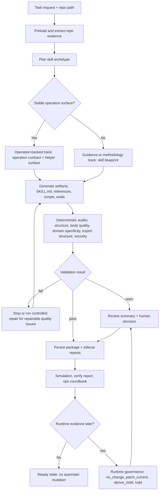

# auto-skills-loop

`auto-skills-loop` is a local, policy-aware framework for creating and governing AI agent skills. It turns repository evidence into skill packages, validates generated artifacts, runs deterministic safety checks, and keeps runtime follow-up decisions reviewable instead of silently mutating state.

[中文说明](README.zh-CN.md)

## Why It Exists

Most skill generators stop at "write a `SKILL.md`." This project treats skill creation as a lifecycle:

- extract repo-grounded requirements
- plan a skill package
- generate `SKILL.md`, references, scripts, and eval scaffolds
- validate structure and safety
- review quality and requirement coverage
- optionally track runtime evidence
- keep pilots, source promotion, and operation-backed follow-ups behind explicit review

The default posture is conservative: read-only reports first, human approval before mutation, and no automatic promotion of generated skills or external sources.

## Core Capabilities

- **Repo-grounded skill creation**: scans code, docs, scripts, configs, and workflows before planning artifacts.
- **Guidance and operation-backed tracks**: supports plain guidance skills and skills derived from a structured operation contract.
- **Evaluation scaffolds**: generates trigger, output, and benchmark checks for generated packages.
- **Security audit gate**: scans generated artifacts for credential access, outbound exfiltration, dynamic execution, persistence, browser session access, prompt injection, and confirmation bypass patterns.
- **Runtime governance**: converts runtime evidence into `no_change`, `patch_current`, `derive_child`, or `hold` decisions without changing defaults automatically.
- **Steady-state operations**: keeps create-seed, prior pilot, public source promotion, and operation-backed backlog decisions visible through read-only CLI reports.

## Quick Start

Requirements:

- Python 3.11+
- `pydantic`

```bash
git clone https://github.com/yangtzehina/auto-skills-loop.git
cd auto-skills-loop
python3 -m venv .venv
source .venv/bin/activate
pip install pydantic
PYTHONPATH=src python3 scripts/run_tests.py
```

Run the steady-state health checks:

```bash
PYTHONPATH=src python3 scripts/run_simulation_suite.py --mode full
PYTHONPATH=src python3 scripts/run_verify_report.py --mode full
PYTHONPATH=src python3 scripts/run_ops_roundbook.py --mode quick --format markdown
PYTHONPATH=src python3 scripts/run_operation_backed_backlog.py --format markdown
```

## Common Commands

```bash
# Validate the default test suite
PYTHONPATH=src python3 scripts/run_tests.py

# Compare simulation fixtures against checked-in projections
PYTHONPATH=src python3 scripts/run_simulation_suite.py --mode quick
PYTHONPATH=src python3 scripts/run_simulation_suite.py --mode full

# Produce a release-style verification summary
PYTHONPATH=src python3 scripts/run_verify_report.py --mode full

# Show the operator roundbook
PYTHONPATH=src python3 scripts/run_ops_roundbook.py --mode quick --format markdown

# Inspect operation-backed steady-state status and backlog
PYTHONPATH=src python3 scripts/run_operation_backed_status.py --format markdown
PYTHONPATH=src python3 scripts/run_operation_backed_backlog.py --format markdown
```

## Architecture

The main flow is:

1. **Preload and extract** repository evidence.
2. **Plan** either a guidance skill or an operation-backed skill.
3. **Generate** skill artifacts, references, scripts, evals, and optional operation contracts.
4. **Validate** frontmatter, artifact structure, eval files, operation contracts, and security posture.
5. **Review** requirement coverage, quality, and repair suggestions.
6. **Govern** runtime follow-up through read-only reports and explicit approval surfaces.

## Creation Flow Diagram



Generated local packages and run artifacts are written under `.generated-skills/` by default. That directory is intentionally ignored for public releases because it is local runtime output, not source code.

You can override the local output root:

```bash
export AUTO_SKILLS_LOOP_OUTPUT_ROOT=/path/to/generated-skills
```

Optional OpenSpace observation/runtime usage integration is disabled unless configured explicitly:

```bash
export AUTO_SKILLS_LOOP_OPENSPACE_PYTHON=/path/to/openspace/python
export AUTO_SKILLS_LOOP_OPENSPACE_DB_PATH=/path/to/openspace.db
```

Legacy `SKILL_CREATE_*` environment variables are still honored for existing local setups.

## Safety Model

The security audit is local and rule-based. It does not rely on a remote service or an LLM as the primary judge.

Default severity behavior:

- `LOW`: informational, proceed
- `MEDIUM`: warn
- `HIGH`: fail
- `REJECT`: fail and refuse

Security failures are treated as non-repairable by default. The system should not auto-polish a malicious or unacceptable skill into something that appears safe.

## Operation-Backed Skills

Operation-backed skills are used only when a repository has a stable operation surface, such as a native CLI, Python backend, shell wrapper, or API client.

For those skills, `auto-skills-loop` can generate:

- `references/operations/contract.json`
- `evals/operation_validation.json`
- `evals/operation_coverage.json`
- a contract-derived `SKILL.md`
- a thin helper script when needed

This does not mean every skill becomes a CLI. Guidance skills remain the default when a repo is documentation-heavy, workflow-heavy, or does not expose a stable operation surface.

## Current Operating Defaults

The repository is intended to run in steady-state by default:

- no automatic create-seed reopening
- no runtime prior enabled by default
- no automatic public source promotion
- no automatic baseline refresh
- no automatic security repair for high-risk findings
- no operation-backed patch/derive unless the backlog reports a real trigger

Use the roundbook and backlog commands to decide whether there is anything actionable.

## References and Inspirations

This project was influenced by several public ideas and repositories:

- [slowmist/slowmist-agent-security](https://github.com/slowmist/slowmist-agent-security): inspired the local security audit framing, red-flag categories, trust boundaries, and agent-safety review posture.
- [HKUDS/CLI-Anything](https://github.com/HKUDS/CLI-Anything): inspired the split between an executable operation surface and an agent-facing skill guidance surface.
- Public skill ecosystems such as Claude/Codex-style skills and curated skill collections: informed discovery, reuse, promotion, and regression workflows.

These are design references, not vendored runtime dependencies.

## License

Apache-2.0. See [LICENSE](LICENSE).
