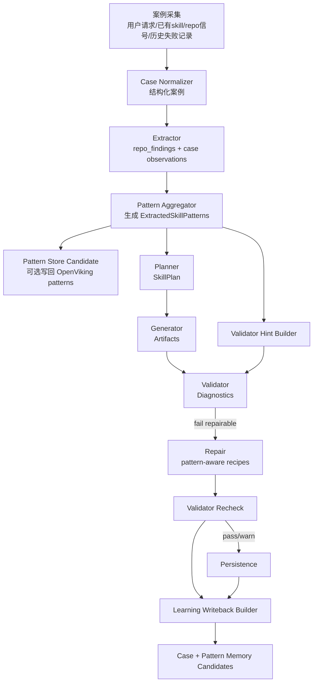

# ExtractedSkillPatterns 设计草案

## 目标

为 `skill-create-v6` 增加一层“模式沉淀”中间产物：把离散案例、repo 信号、生成/修复结果，收敛成一份可被 planner / generator / validator / repair 复用的结构化模式集 `ExtractedSkillPatterns`。

这层的价值是：

1. **把一次性案例变成可复用规律**，避免每次都从头推断。
2. **让 extractor 与 planner 解耦**：extractor 负责“看见了什么”，pattern 层负责“哪些经验可以复用”。
3. **让 validator / repair 更有依据**：不仅知道失败了，还知道“应该按哪类成熟模式修”。
4. **与 OpenViking 的 cases / patterns 记忆结构天然对齐**：案例进 `cases/`，沉淀结果进 `patterns/`。

---

## 与当前 v6 链路的衔接

当前链路：

```text
preloader
-> extractor
-> planner
-> generator
-> validator
-> repair(optional)
-> validator(recheck)
-> persistence
```

建议演进为：

```text
preloader
-> extractor
-> pattern-aggregator / pattern-memory
-> planner
-> generator
-> validator
-> repair(optional)
-> validator(recheck)
-> learning-writeback(optional)
-> persistence
```

其中：

- **extractor**：继续产出 repo_findings / case-like observations。
- **pattern-aggregator**：把当前请求、历史案例、repo 信号聚合成 `ExtractedSkillPatterns`。
- **planner**：用 patterns 约束文件结构、预算、引用拆分策略。
- **generator**：用 patterns 控制 `SKILL.md` / `references/` / `scripts/` 的内容形状。
- **validator**：根据 patterns 衍生出的检查项做针对性校验。
- **repair**：根据 patterns 附带的 repair recipes 做定向修复。
- **learning-writeback**：只有在主会话认可时，才把高质量 pattern/case 写回 OpenViking；不自动全量写入。

---

## 一、`ExtractedSkillPatterns` 顶层 schema

> 详细 JSON Schema 见 `docs/extracted-skill-patterns.schema.json`

### 顶层字段

| 字段 | 类型 | 必要 | 说明 |
|---|---|---:|---|
| `schema_version` | string | 是 | schema 版本，建议从 `1.0.0` 起步 |
| `pattern_set_id` | string | 是 | 本次沉淀产物唯一 ID |
| `scope` | object | 是 | 本次模式集适用范围 |
| `extraction` | object | 是 | 抽取上下文、来源、运行信息 |
| `summary` | object | 是 | 从多个案例归纳出的总览 |
| `patterns` | array | 是 | 模式明细列表，至少 1 个 |
| `aggregated_hints` | object | 是 | 面向 planner/generator/validator/repair 的聚合提示 |
| `quality` | object | 是 | 当前模式集质量与审核状态 |
| `writeback` | object | 否 | 回写学习建议与 memory candidates |
| `examples` | array | 否 | 代表性样例，供 debug / prompt grounding / 人工复核 |

### `scope`

| 字段 | 类型 | 必要 | 说明 |
|---|---|---:|---|
| `domain` | string | 是 | 固定建议为 `skill-create` |
| `target_kind` | string | 是 | 固定建议为 `AgentSkill` |
| `target_name` | string | 否 | 目标 skill 名称或 hint |
| `request_modes` | string[] | 否 | 如 `create` / `refine` / `audit` / `extract` |
| `repo_paths` | string[] | 否 | 当前参与抽取的 repo 路径 |
| `existing_skill_path` | string | 否 | 若是 refine/audit，可记录已有 skill 路径 |

### `extraction`

| 字段 | 类型 | 必要 | 说明 |
|---|---|---:|---|
| `run_id` | string | 是 | 本次 skill-create run 的 ID |
| `created_at` | string | 是 | ISO8601 时间 |
| `extractor_version` | string | 是 | 抽取逻辑版本，如 `v6-pattern-draft1` |
| `source_case_ids` | string[] | 是 | 参与归纳的案例 ID |
| `source_case_count` | integer | 是 | 参与案例数量 |
| `source_pattern_set_ids` | string[] | 否 | 继承/复用的旧 pattern set |
| `repo_snapshot_refs` | string[] | 否 | 参与抽取的 repo 快照、commit、路径摘要等 |
| `llm_model` | string | 否 | 若使用 LLM 聚合，记录模型名 |
| `notes` | string[] | 否 | 调试/人工备注 |

### `summary`

| 字段 | 类型 | 必要 | 说明 |
|---|---|---:|---|
| `goals` | string[] | 是 | 抽取出的主要目标 |
| `common_constraints` | string[] | 否 | 多案例共享约束 |
| `dominant_skill_types` | string[] | 否 | 常见 skill 类型 |
| `recommended_defaults` | object | 否 | 聚合出的默认策略，如 budget/script policy |
| `open_questions` | string[] | 否 | 还需人工确认的问题 |

---

## 二、`patterns[]` 单条模式设计

每条 `SkillPattern` 代表一个可复用的“规律单元”，而不是原始案例复制。

### 单条模式字段

| 字段 | 类型 | 必要 | 说明 |
|---|---|---:|---|
| `pattern_id` | string | 是 | 模式 ID |
| `pattern_type` | string | 是 | 模式类别 |
| `status` | string | 是 | `candidate` / `accepted` / `deprecated` |
| `title` | string | 是 | 模式标题 |
| `summary` | string | 是 | 模式一句话摘要 |
| `applicability` | object | 是 | 何时用/何时别用 |
| `evidence` | object | 是 | 来自哪些案例，支持强度如何 |
| `file_shape` | object | 否 | 对目录/文件结构的建议 |
| `content_hints` | object | 否 | 对内容生成的约束 |
| `downstream_hints` | object | 是 | 给下游阶段的可执行提示 |
| `confidence` | number | 是 | 0~1 |
| `support` | integer | 是 | 支持该模式的案例数 |
| `tags` | string[] | 否 | 检索标签 |
| `supersedes_pattern_id` | string | 否 | 若替代旧模式，可指向旧 ID |

### `pattern_type` 建议枚举

第一版建议覆盖这些类型：

- `trigger-description`
- `skill-shape`
- `reference-split`
- `script-threshold`
- `workflow-structure`
- `validator-rule`
- `repair-recipe`
- `anti-pattern`

### `applicability`

| 字段 | 类型 | 必要 | 说明 |
|---|---|---:|---|
| `use_when` | string[] | 是 | 正向适用条件 |
| `avoid_when` | string[] | 否 | 明确不适用场景 |
| `required_repo_signals` | string[] | 否 | 必要 repo 信号 |
| `negative_repo_signals` | string[] | 否 | 排斥信号 |
| `request_modes` | string[] | 否 | 限定适用 mode |
| `priority` | integer | 否 | 冲突时排序，默认 50 |

### `evidence`

| 字段 | 类型 | 必要 | 说明 |
|---|---|---:|---|
| `source_case_ids` | string[] | 是 | 来源案例 |
| `occurrence_count` | integer | 是 | 出现次数 |
| `success_rate` | number | 否 | 命中后成功率 |
| `example_snippets` | array | 否 | 代表性片段 |
| `failure_modes` | string[] | 否 | 已知失败方式 |

### `file_shape`

| 字段 | 类型 | 必要 | 说明 |
|---|---|---:|---|
| `required_files` | string[] | 否 | 必须生成/保留的文件 |
| `optional_files` | string[] | 否 | 可选文件 |
| `extraction_targets` | string[] | 否 | 倾向拆出的 reference/script 目标 |
| `script_strategy` | string | 否 | 如 `prefer-deterministic-script-for-fragile-repetition` |
| `content_budget_hint` | integer | 否 | 如 `SKILL.md` 行数预算 |

### `content_hints`

| 字段 | 类型 | 必要 | 说明 |
|---|---|---:|---|
| `must_include` | string[] | 否 | 必须出现的内容 |
| `should_include` | string[] | 否 | 倾向包含 |
| `must_avoid` | string[] | 否 | 必须避免 |
| `references_to_read` | string[] | 否 | 下游应优先读取的 reference |
| `example_phrasings` | string[] | 否 | 触发描述/文案示例 |

### `downstream_hints`

| 字段 | 类型 | 必要 | 说明 |
|---|---|---:|---|
| `planner_actions` | string[] | 是 | 对 planner 的动作建议 |
| `generator_actions` | string[] | 是 | 对 generator 的动作建议 |
| `validator_checks` | string[] | 是 | 对 validator 的检查建议 |
| `repair_recipes` | string[] | 是 | 对 repair 的修复建议 |

---

## 三、推荐的样例模式

下面是第一版最值得落地的 5 类模式：

### 1) 触发描述模式 `trigger-description`

- 目标：让 `description` 同时覆盖“做什么 + 何时使用”。
- 典型规则：不要把“when to use”写在 body 才说；要写进 frontmatter description。
- 下游影响：
  - planner：优先为 SKILL.md 预留 frontmatter 强化空间
  - generator：生成 description 时带触发语义
  - validator：检查 description 是否同时包含能力和触发条件
  - repair：自动重写 description

### 2) 进阶披露模式 `reference-split`

- 目标：把细节从 `SKILL.md` 抽到 `references/`
- 触发条件：`SKILL.md` 超预算、出现多个变体、出现大段说明性文字
- 下游影响：
  - planner：新增 reference 文件
  - generator：在 `SKILL.md` 留路由指针
  - validator：检查 reference 是否被引用
  - repair：补导航、补目录、补 pointer

### 3) 脆弱重复步骤脚本化 `script-threshold`

- 目标：识别“应该沉淀成 scripts/”的重复脆弱步骤
- 触发条件：多次重写同类逻辑，或执行顺序脆弱
- 下游影响：
  - planner：生成脚本占位文件
  - generator：放入 deterministic helper
  - validator：检查脚本非 placeholder、非 wrapper-only
  - repair：填充最小可运行脚本骨架

### 4) 技能入口瘦身模式 `skill-shape`

- 目标：保证 `SKILL.md` 只保留核心流程与路由信息
- 下游影响：
  - validator：检查无 README/CHANGELOG 等噪音文件依赖
  - repair：删除无关内容或迁移到 references

### 5) 定向修复模式 `repair-recipe`

- 目标：让 repair 不再是纯通用 patch，而是模式驱动 patch
- 例子：
  - `invalid_frontmatter` -> frontmatter 重建 recipe
  - `reference_structure_incomplete` -> 补 H1/目录/导航 recipe
  - `script_wrapper_like` -> 补真实入口/参数/主函数 recipe

---

## 四、完整数据流设计

## 4.1 Mermaid 图



## 4.2 分阶段说明

### 阶段 A：案例采集

输入来源：

- 当前请求（task / mode / skill_name_hint / repo_paths）
- preloader 扫描出的 repo 文件与 preview
- 当前 run 的 validator / repair 结果
- 历史高质量案例（来自 `cases/`）
- 历史已接受 patterns（来自 `patterns/`）

输出建议：`NormalizedSkillCase`

最少应包含：

- `case_id`
- `request_summary`
- `mode`
- `repo_signals`
- `actions_taken`
- `outcome_quality`
- `failures`
- `artifacts_summary`

### 阶段 B：抽取

当前 extractor 已经能产出：

- `repo_findings`
- `cross_repo_signals`
- `candidate_resources`

建议扩展为同时产出：

- `case_observations`
- `candidate_pattern_clues`

这里不要求 extractor 直接定论“这是成熟模式”，只负责把线索抽出来。

### 阶段 C：模式沉淀（新增核心层）

输入：

- 当前 run 的 `repo_findings`
- 历史 `ExtractedSkillPatterns`
- 最近 N 条 `NormalizedSkillCase`
- 可选：人工确认过的 policy / guardrails

输出：`ExtractedSkillPatterns`

职责：

1. 聚类同类线索
2. 过滤噪声/一次性特例
3. 形成可下游复用的 pattern 条目
4. 给出 planner / validator / repair 的聚合提示
5. 产出 writeback candidates，但**不自动持久化**

### 阶段 D：规划 / 生成

- planner 消费：`repo_findings + extracted_patterns`
- generator 消费：`skill_plan + extracted_patterns`

这里的关键变化是：

- `SkillPlan.files_to_create` 不再只从 repo candidate resources 推断，也受 pattern 约束。
- generator 不再仅依赖规则 fallback，而是可优先应用成熟模式里的 content hints。

### 阶段 E：校验 / 修复

validator 增加两个来源：

1. 通用规则（当前已有）
2. pattern-specific checks（新增）

repair 增加两个来源：

1. 通用 deterministic fix（当前已有）
2. pattern-specific recipe（新增）

### 阶段 F：回写学习

只在满足以下条件时产生持久化候选：

- 本次 artifacts 经 validator/recheck 后达到 `pass` 或低风险 `warn`
- pattern 置信度高于阈值
- 与现有 pattern 不冲突或被显式标记为 supersede
- 主会话允许写入 OpenViking

回写对象分两类：

- `cases/`：记录这次 run 的案例与成败
- `patterns/`：记录本次沉淀出的高置信模式集

---

## 五、与当前代码结构的衔接点

## 5.1 建议新增模型

- `src/openclaw_skill_create/models/patterns.py`
  - `ExtractedSkillPatterns`
  - `SkillPattern`
  - 若干子结构模型

## 5.2 建议新增服务

- `services/pattern_aggregator.py`
  - 输入：`request`, `repo_context`, `repo_findings`, 可选 `historical_cases`, `historical_patterns`
  - 输出：`ExtractedSkillPatterns`

- `services/pattern_memory.py`
  - 负责把 OpenViking 中的 `cases/` 与 `patterns/` 装配成输入上下文
  - 只返回候选，不直接写入长期记忆

## 5.3 对 orchestrator 的最小侵入改造

建议新增：

```text
repo_context = preload_repo_context(request)
repo_findings = run_extractor(...)
extracted_patterns = run_pattern_aggregator(...)
skill_plan = run_planner(..., extracted_patterns=extracted_patterns)
artifacts = run_generator(..., extracted_patterns=extracted_patterns)
diagnostics = run_validator(..., extracted_patterns=extracted_patterns)
repair_result = run_repair(..., extracted_patterns=extracted_patterns)
writeback = build_learning_writeback(...)
```

最小变更原则：

- 先把 `extracted_patterns` 作为**可选参数**加到 planner/generator/validator/repair。
- 若为空，则保持当前 v6 逻辑不变。
- 先做 deterministic aggregator，再视情况加 LLM aggregation。

---

## 六、建议落地顺序

### Phase 1：结构先行（低风险）

1. 增加 `patterns.py` 数据模型
2. 增加 `docs/extracted-skill-patterns.schema.json`
3. 在 orchestrator 响应里临时增加 `extracted_patterns: Optional[...]`
4. 先做纯 deterministic `pattern_aggregator`

### Phase 2：消费模式（中风险）

1. planner 读取 `aggregated_hints.planner_defaults`
2. generator 读取 `content_hints`
3. validator 读取 `validator_checks`
4. repair 读取 `repair_recipes`

### Phase 3：学习闭环（高收益）

1. 记录 successful run -> `cases/`
2. 聚合 accepted runs -> `patterns/`
3. 只把 `memory_candidates` 交给 OpenClaw 主会话裁决

---

## 七、一个最小可用样例

见：

- `docs/extracted-skill-patterns.example.json`
- `docs/extracted-skill-patterns.schema.json`

这个样例覆盖了：

- 触发描述模式
- progressive disclosure 模式
- validator / repair 对接字段

---

## 八、关键设计决策

1. **patterns 不替代 repo_findings，而是建立在 repo_findings 之上**。
2. **patterns 是“可执行经验”，不是纯摘要**，所以必须包含 downstream hints。
3. **先支持 deterministic aggregation，再支持 LLM aggregation**，避免一开始链路过重。
4. **writeback 默认是候选，不是自动写入**，与当前 OpenViking 策略保持一致。
5. **pattern 质量必须显式建模**，否则长期会累积低质量经验污染生成链路。

---

## 九、当前限制

1. 当前 v6 代码里还没有 `case` 的正式模型，案例层需要补一层标准化结构。
2. validator / repair 目前仍是通用规则主导，pattern-aware 检查尚未接入。
3. 现有 response model 还没有 `extracted_patterns` 字段。
4. OpenViking 侧虽然已经有 `cases/` 与 `patterns/` 分类，但 skill-create 还没有正式接入读取/回写协议。

---

## 十、下一步建议

1. 先把 `patterns.py` 和 `schema.json` 合入，锁定字段边界。
2. 在 orchestrator 上增加 `extracted_patterns` 可选输出，不改默认行为。
3. 做一个 deterministic `pattern_aggregator`：从 `repo_findings + diagnostics` 归纳 3~5 类模式。
4. 先只接 planner/validator 两端，验证价值，再接 generator/repair。
5. 等链路稳定后，再接 OpenViking 的 `cases/` / `patterns/` 读写闭环。
